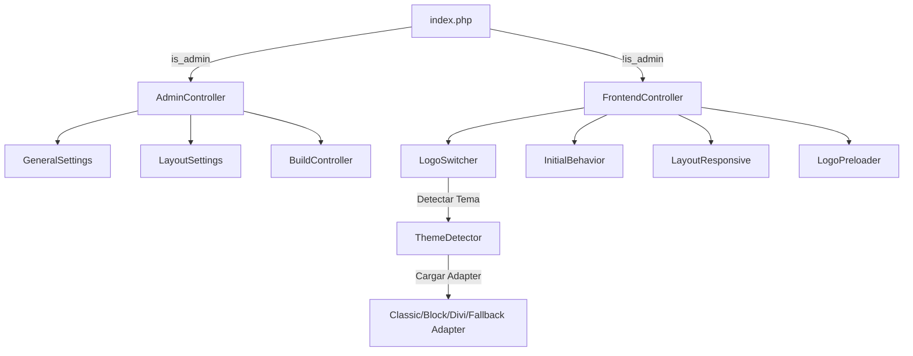

# Guía Técnica del Desarrollador — Hooma Smart Header

Este documento sirve como un mapa técnico completo y guía de referencia rápida para el mantenimiento, depuración y desarrollo de nuevas características en el plugin **Hooma Smart Header**. Al consultar esta guía, no es necesario inspeccionar todos los archivos del repositorio para comprender la arquitectura o saber dónde realizar cambios.

---

## 📂 Estructura de Directorios y Archivos

```text
hooma-smart-header/
├── index.php                   # Punto de entrada (bootstrap, Identity Injection del Core)
├── package.json                # Configuración de dependencias NPM (esbuild)
├── build.js                    # Script de Node.js para bundler y tree-shaking
├── config/
│   └── navigation.php          # Definición de la estructura de pestañas en el panel administrativo
├── includes/                   # Código de backend PHP (Autoloading PSR-4)
│   ├── Lifecycle.php           # Implementación del ciclo de vida del módulo (Install/Uninstall)
│   ├── Controllers/
│   │   ├── Admin/              # Lógica administrativa (Admin UI y AJAX)
│   │   │   ├── AdminController.php   # Controlador principal del panel, encolamiento de scripts y guardado AJAX
│   │   │   ├── BuildController.php   # Disparador y manejador AJAX para compilación esbuild
│   │   │   ├── GeneralSettings.php   # Verificación en vivo de selectores y reseteo de defaults
│   │   │   └── LayoutSettings.php    # Actualización en base de datos de la altura medida del header
│   │   └── Frontend/           # Lógica pública (Frontend Rendering y CSS/JS inline)
│   │       ├── FrontendController.php # Orquestador de encolado público e inyección de datos (wp_localize_script)
│   │       ├── InitialBehavior.php   # Body classes iniciales y CSS crítico de carga (flicker protection)
│   │       ├── LayoutResponsive.php  # Placeholder dinámico, View Transitions e inyección de CSS responsivo
│   │       ├── LogoPreloader.php     # Optimización LCP mediante pre-cargas y escaneo de DOM por búfer
│   │       └── LogoSwitcher.php      # Setup del logo inicial usando adaptadores de tema nativos
│   ├── Services/               # Servicios de lógica compartida
│   │   ├── BuildCondition.php  # Verificador del entorno de servidor (Node/NPM y proc_open)
│   │   ├── BuildService.php    # Ejecutor de la compilación y creador del fallback loader
│   │   ├── ConditionEvaluator.php # Evaluador de reglas de exclusión/inclusión de vistas en backend
│   │   └── ThemeDetector.php   # Detector de temas activos y cargador de adaptadores
│   └── Themes/                 # Adaptadores específicos para integración nativa de Logos
│       ├── ThemeAdapterInterface.php # Interfaz base de estrategias
│       ├── DiviThemeAdapter.php    # Intercepta búfer HTML en PHP mediante DOMDocument para Divi
│       ├── BlockThemeAdapter.php   # Filtro render_block de Gutenberg para temas FSE (core/site-logo)
│       ├── ClassicThemeAdapter.php # Filtros wp_get_attachment_image_src y get_custom_logo
│       └── FallbackThemeAdapter.php # Delegación de carga inicial al frontend JS
├── assets/                     # Recursos estáticos
│   ├── css/
│   │   ├── admin-smart-header.css # Estilos visuales del Panel de Configuración
│   │   └── hooma-smart-header.css # Hoja de estilos del frontend público (bajo @layer CSS)
│   └── js/
│       ├── admin-*.js          # Scripts individuales para cada pestaña de configuración
│       ├── hooma-helpers.js    # Funciones de utilidad comunes de JS responsivo y comprobación de estado
│       ├── hooma-initial-behavior.js # Lógica JS de Fase 1 (Visualización inicial tras scroll)
│       ├── hooma-scroll-behavior.js  # Lógica JS de Fase 2 (Smart Reveal en scroll dinámico)
│       ├── hooma-responsive-behavior.js # Gestión de placeholders, ResizeObserver y sincronización de altura
│       ├── hooma-logo-switcher.js # Cross-fade de logotipos sticky usando MutationObserver (cero CLS)
│       ├── hooma-top-header-behavior.js # Control de deslizamiento y offsets para secondary bars (#top-header)
│       ├── hooma-smart-header.js # Entry point de desarrollo (ES Modules independientes)
│       └── dist/
│           └── hooma-smart-header.min.js # Bundle unificado por esbuild (o fallback loader dinámico)
```

---

## 🏛️ Flujo Arquitectónico Principal

El plugin sigue un patrón **MVC/Service** robusto e independiente del Core de WordPress, pero perfectamente acoplado a la estructura de módulos de **Hooma Core**.



### 1. Inicialización (Bootstrap)
- Ubicación: `index.php`
- Recupera las variables locales que inyecta automáticamente el Hooma Core (`$module_namespace`, `$module_slug`, `$module_version`, `$modules_url`).
- Dependiendo de `is_admin()`, instancia e inicia `AdminController` o `FrontendController`.

### 2. Panel Administrativo (Backend)
- Ubicación: `includes/Controllers/Admin/AdminController.php`
- Define la opción maestra de almacenamiento en base de datos: `hooma_smart_header_settings`.
- Implementa una función de **smart merge** (`smart_merge`) y sanitización recursiva para actualizar de forma segura solo las secciones del formulario enviadas, evitando borrar las demás pestañas.
- Encola condicionalmente los estilos y scripts administrativos necesarios para la pestaña actual (`$_GET['tab']`) para mantener una huella de memoria limpia.

---

## ⚙️ Estructura del Almacenamiento (Settings Schema)

Los ajustes se almacenan en un array serializado bajo la opción `hooma_smart_header_settings`. Los campos principales son:

| Key Principal | Sub-Keys | Descripción |
| :--- | :--- | :--- |
| `selectors` | `header`, `sticky`, `logo`, `view_transition_name` | Selectores CSS de los elementos clave en el DOM. |
| `behavior` | `hide_on_scroll`, `trigger_type`, `scroll_min`, `trigger_selector`, `animation`, `show_once`, `mobile` | Configuración del comportamiento inicial (Fase 1). |
| `scroll_behavior` | `enabled`, `sensitivity`, `mobile`, `display_mode`, `display_types`, `display_ids`, `display_body_classes` | Configuración de Smart Reveal al hacer scroll (Fase 2). |
| `logo_switcher` | `enabled`, `initial_logo`, `alt_logo`, `max_width`, `trigger_selector`, `state_class`, `disable_desktop`, `disable_tablet`, `disable_mobile`, `display_mode`... | Configuración de intercambio dinámico de logos. |
| `layout` | `placeholder`, `target`, `height_mode`, `height_val`, `backup_height`, `backup_height_tablet`, `backup_height_mobile`... | Manejo de placeholders, margen negativo (Pull-up) y alturas de respaldo. |
| `mobile` | `use_custom_breakpoints`, `breakpoint`, `tablet_breakpoint` | Gestión global de breakpoints personalizados. |

---

## ⚡ El Sistema de Build y Fallback (Bundler)

Para maximizar el rendimiento de velocidad en el frontend del cliente, el plugin implementa un sistema híbrido de entrega de JavaScript controlado desde la pestaña **Optimización / Build**.

### 1. Compilación mediante esbuild
- Ubicación: `build.js` y `includes/Services/BuildService.php`
- Si el servidor tiene Node.js + NPM activos y `proc_open` habilitado en PHP, se ejecuta una build de optimización local.
- **Feature Flags a Nivel de Compilación:** Se pasan argumentos a `build.js` (`--logo=0/1`, `--scroll=0/1`, `--initial=0/1`). `esbuild` reemplaza estas constantes globales del compilador (`HOOMA_SH_LOGO_ENABLED`, etc.) y realiza **Tree-Shaking / Dead Code Elimination**, eliminando físicamente las funciones y módulos JS no utilizados del archivo final `.min.js`.

### 2. Mecanismo de Fallback (Cero Errores 404)
- Si el servidor no cumple con las condiciones óptimas (servidor compartido o sin Node.js), `BuildService` entra en modo fallback.
- Crea un archivo "stub" ligero en `assets/js/dist/hooma-smart-header.min.js` que contiene:
  ```javascript
  // Hooma Smart Header — Fallback Loader (build no disponible)
  import '../hooma-smart-header.js';
  ```
- Dado que el script se encola utilizando `type="module"` (mediante el filtro `script_loader_tag` en `FrontendController.php`), el navegador del cliente resolverá e importará automáticamente y de forma nativa los módulos ES separados desde la carpeta `/assets/js/`. El sitio nunca romperá y nunca devolverá un error de recurso no encontrado.

---

## 🎨 Optimización Visual y Prevención de Layout Shifts (CLS Protection)

Una prioridad del plugin es la entrega visual instantánea libre de parpadeos (layout shift) o saltos bruscos. Para ello, se implementan varias técnicas coordinadas:

### 1. CSS Crítico del Comportamiento Inicial (wp_head)
- Ubicación: `includes/Controllers/Frontend/InitialBehavior.php` -> `output_critical_css()`
- Si está activo "Ocultar antes de hacer scroll", el plugin inyecta un bloque `<style>` en el `<head>` del HTML antes de que se cargue cualquier archivo JS.
- Utiliza la clase `body.hooma-sh-pre-init` (agregada mediante el filtro `body_class`) para ocultar el header (`opacity: 0` o `transform: translateY(-100%)`) y deshabilitar sus eventos. Una vez que el DOM está listo y el JS del plugin inicializa su estado real, remueve la clase `hooma-sh-pre-init`, ejecutando una transición de entrada suave.

### 2. Sincronización Temprana de Altura e Inline Script
- Ubicación: `includes/Controllers/Frontend/LayoutResponsive.php` -> `inject_placeholder_div()`
- Inmediatamente después de abrir el `<body>` (`wp_body_open`), se inyecta un elemento placeholder `<div id="hoo-sh-placeholder" style="display:none;"></div>` y un script síncrono ultra-rápido:
  ```javascript
  (function() {
      var h = document.querySelector('header');
      if (h) {
          var height = h.offsetHeight;
          if (height > 0) {
              document.documentElement.style.setProperty('--hoo-header-height', height + 'px');
              document.documentElement.style.setProperty('--hoo-dynamic-header-height', height + 'px');
          }
      }
  })();
  ```
- Esto calcula y define las variables de CSS en `:root` en las etapas más tempranas de la carga del DOM para ajustar el placeholder al instante, previniendo el parpadeo del contenido antes de la carga de scripts externos.

### 3. Puente de Caché Automático (Cache Bridge)
- Ubicación: `assets/js/hooma-responsive-behavior.js` -> `initCacheBridge()`
- Cuando el cálculo de altura está configurado en automático, para evitar esperar a la carga del DOM en visitas subsiguientes, el frontend del plugin compara la altura real del header contra el valor actualmente guardado en base de datos.
- Si difieren por más de 2px, realiza una petición rápida fetch a `hooma_sh_update_height` (controlado por `LayoutSettings.php`) para guardar la altura exacta medida en caliente. En la siguiente recarga, el backend inyectará esa altura real y exacta directamente en el CSS crítico de `wp_head`, permitiendo que el placeholder del lado del servidor tenga las dimensiones perfectas.

---

## 🖼️ Estrategia Multitema para Logotipos (Zero Shift Switcher)

El cambio de logo se realiza bajo dos flujos de rendimiento sumamente sofisticados según la compatibilidad del tema activo.

### 1. Fase PHP (Pre-render en Servidor)
- Evita que el cliente vea el logo original del tema y luego parpadee al logo inicial configurado en el plugin.
- **Block Themes (Gutenberg / FSE):** `BlockThemeAdapter.php` utiliza el filtro `render_block` para interceptar el bloque `core/site-logo`, modificando mediante expresiones regulares la URL de `src` y removiendo `srcset/sizes`.
- **Classic Themes (Astra, etc.):** `ClassicThemeAdapter.php` se engancha a `get_custom_logo` y al filtro `wp_get_attachment_image_src` del ID del logo del customizer de WordPress para inyectar la URL del logo personalizado desde el backend.
- **Divi Theme:** `DiviThemeAdapter.php` utiliza almacenamiento en búfer de salida (`ob_start` / `ob_end_flush`) en PHP para buscar mediante `DOMDocument` y `DOMXPath` etiquetas `img` que pertenezcan a los menús nativos o logo de Divi, sustituyéndolos quirúrgicamente en servidor.

### 2. Fase Frontend (Cross-Fade JS de Cero CLS)
- Ubicación: `assets/js/hooma-logo-switcher.js`
- En lugar de sustituir dinámicamente el atributo `src` en caliente (lo que provocaría layout shift porque el navegador tendría que descargar y redibujar la imagen provocando saltos de tamaño), el plugin hace lo siguiente:
  - Envoltura del logotipo original dentro de un contenedor relativo `.hoo-logo-wrapper`.
  - Inyección de una segunda imagen oculta de forma absoluta `.hoo-logo-alt` que contiene el logotipo alternativo.
  - Cuando se detecta el estado sticky o scroll (usando un `MutationObserver` en el header), simplemente cambia las opacidades en CSS de `1` a `0` y viceversa en ambas imágenes con una transición de `0.4s`. Las dimensiones del contenedor se mantienen perfectamente estables debido a la imagen relativa original, logrando una animación sumamente limpia y fluida.

---

## 🚀 Pre-cargas Inteligentes y LCP (Logo Preloader)

Para optimizar al máximo las métricas de **Largest Contentful Paint (LCP)** exigidas por Google PageSpeed Insights, el plugin implementa un sistema inteligente de precarga de imágenes críticas.

- Ubicación: `includes/Controllers/Frontend/LogoPreloader.php`
- Encolamiento nativo de pre-cargas en `wp_head` con prioridad máxima `1`.
- Recopila automáticamente las siguientes imágenes nativas para precargarlas:
  1. El logotipo inicial (`initial_logo`) configurado en el plugin.
  2. El logotipo alternativo (`alt_logo`) configurado.
  3. El logotipo nativo de WordPress (Theme Customizer) junto con sus atributos `srcset` e `imagesizes` si existen.
  4. El logotipo de Divi del tema activo.
- **Escáner Dinámico por Búfer (Fallback):** Si no hay logos nativos cargados o es la primera carga del sitio, arranca un búfer de salida para el HTML completo. Analiza el árbol del DOM con `DOMXPath` bajo el selector del header seleccionado en busca de imágenes (soportando atributos lazy-load populares como `data-src`, `data-lazy-src`, etc.). Guarda los logos dinámicos detectados en la opción de caché `hooma_sh_header_images_cache` para que en las siguientes visitas de usuarios la precarga sea inmediata en servidor sin necesidad de procesar búferes pesados de PHP.

---

## 📑 Cheat Sheet Técnico: Variables CSS y Clases

### 1. Variables CSS Inyectadas en `:root`
- `--hoo-header-height`: Altura estática combinada total del header y top-header (usada para dimensionar el placeholder).
- `--hoo-dynamic-header-height`: Altura medida en tiempo real por el `ResizeObserver`.
- `--hoo-header-top`: Offset superior dinámico del header fijo (calculado sumando la barra de administración de WordPress y el top-header).
- `--hoo-header-top-base`: Offset de base (altura medida únicamente de la barra de administración de WordPress).
- `--hoo-top-header-max-height`: Restricción temporal de altura del top-header durante la carga inicial para evitar saltos del DOM.
- `--hoo-pull-up-mt`: Margen superior negativo compensatorio calculado para la sección target principal (Pull Up).
- `--hoo-sh-scroll-y`: Transformación de traslación del header en scroll (`translateY`).
- `--hoo-top-header-mt`: Margen superior del top-header para ocultarlo o mostrarlo dinámicamente en scroll.
- `--hoo-main-header-mt`: Margen superior del header principal.

### 2. Clases de Estado en Body (`<body>`)
- `hooma-sh-pre-init`: Presente temporalmente al cargar el sitio. Oculta el header de manera crítica. Removida tras la inicialización de JavaScript.
- `hoo-sh-compensation`: Activa las reglas CSS del placeholder y posicionamientos fijos en dispositivos correspondientes.
- `hooma-sh-has-placeholder`: Indica que el placeholder dinámico está activo en el HTML.
- `hooma-sh-is-forced-fixed`: Se añade cuando la opción "Forzar Header Fixed" está activa en la resolución actual del usuario. Aplica un `padding-top` dinámico compensatorio al `body`.
- `hoo-is-scrolling-down` / `hoo-is-scrolling-up`: Inyectadas dinámicamente en scroll. Útiles para animaciones CSS basadas en la dirección del movimiento del usuario.

### 3. Clases de Estado en Header (`<header>`)
- `hoo-is-at-top` / `hoo-is-scrolled`: Determina si la página está en el punto inicial (`scrollY === 0`) o si el usuario se ha desplazado hacia abajo.
- `hoo-is-fixed`: Indica que la propiedad de posicionamiento calculada por CSS es `fixed`.
- `hoo-is-sticky`: Añadido mediante un `MutationObserver` cuando el selector o clase sticky del tema se activa en el DOM. Dispara la animación de cambio de logo.
- `hoo-is-hidden` / `hoo-is-visible`: Clases de control aplicadas en JS para animar u ocultar el header según los thresholds o scroll direction.

---

## 🛠️ Modificar y Añadir Nuevos Ajustes (Flujo de Desarrollo)

Si necesitas añadir un nuevo input o funcionalidad a cualquiera de las secciones del plugin, sigue este proceso paso a paso:

1. **Definir la Vista del Campo:**
   - Abre la pestaña de la vista correspondiente en `admin/views/`. Por ejemplo, `responsive-behavior.php`.
   - Crea el input HTML asegurándote de que use el atributo `name` estructurado bajo la opción del plugin. Ejemplo:
     ```html
     <input type="checkbox" class="hsh-toggle" 
            name="hooma_smart_header_settings[layout][mi_nuevo_ajuste]" 
            value="1" <?php checked(_hsh_val($options, 'layout.mi_nuevo_ajuste'), '1'); ?>>
     ```

2. **Añadir Sanitización en Backend:**
   - Abre `includes/Controllers/Admin/AdminController.php`.
   - Busca el método `sanitize_settings($input)`.
   - Si tu ajuste es un checkbox, debes asegurarte de definir una regla de sobreescritura (sentinel check). Los checkboxes de HTML no envían su campo en el POST si no están marcados. Por lo tanto, debes forzar su valor a `0` si la sección correspondiente es enviada pero tu clave está ausente:
     ```php
     if (!isset($new_data['mi_nuevo_ajuste'])) {
         $new_data['mi_nuevo_ajuste'] = '0';
     }
     ```

3. **Inyectar la Variable al Frontend (Si se requiere en JS):**
   - Abre `includes/Controllers/Frontend/FrontendController.php`.
   - Ubica el método `enqueue_assets()`.
   - Agrega tu nuevo ajuste dentro del array `$vars` para que se exponga automáticamente en el objeto global de JS del navegador (`HoomaSHConfig`):
     ```php
     'mi_nuevo_ajuste' => isset($options['layout']['mi_nuevo_ajuste']) ? $options['layout']['mi_nuevo_ajuste'] : '0',
     ```

4. **Consumir el Campo en Frontend:**
   - Abre el archivo modular de JavaScript correspondiente dentro de `assets/js/`. Por ejemplo, `hooma-responsive-behavior.js`.
   - Accede a la configuración cargada del lado del cliente a través de:
     ```javascript
     const config = window.HoomaSHConfig;
     if (config.layout.mi_nuevo_ajuste === '1') {
         // Tu lógica personalizada aquí...
     }
     ```

5. **Regenerar el Bundle Minificado:**
   - Ve a la pestaña **Optimización / Build** de la interfaz administrativa de tu sitio y haz clic en **Generar Nueva Build**.
   - O bien, si estás en tu entorno de desarrollo local, ejecuta en tu terminal dentro del directorio del plugin:
     ```bash
     npm run build
     ```
   - ¡Tu nueva funcionalidad está lista y optimizada sin código muerto!
